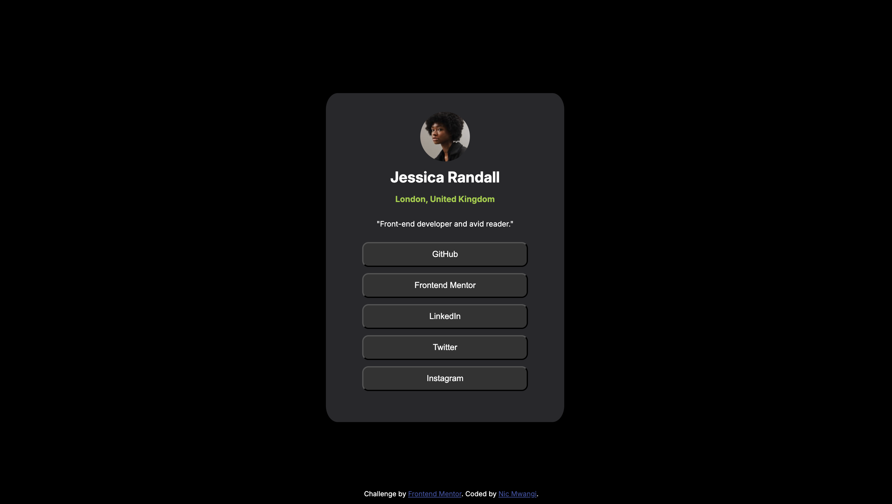
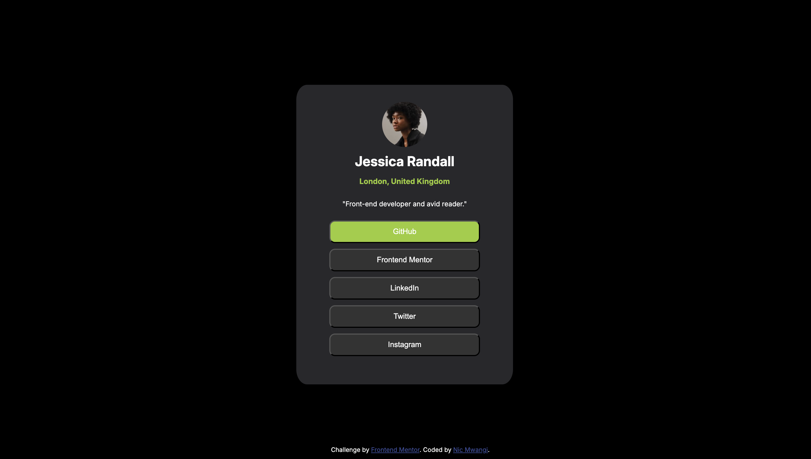

# Frontend Mentor - Social links profile solution

This is a solution to the [Social links profile challenge on Frontend Mentor](https://www.frontendmentor.io/challenges/social-links-profile-UG32l9m6dQ). Frontend Mentor challenges help you improve your coding skills by building realistic projects. 

## Table of contents

- [Overview](#overview)
  - [The challenge](#the-challenge)
  - [Screenshot](#screenshot)
  - [Links](#links)
- [My process](#my-process)
  - [Built with](#built-with)
  - [What I learned](#what-i-learned)
  - [Continued development](#continued-development)
  - [Useful resources](#useful-resources)
- [Author](#author)
- [Acknowledgments](#acknowledgments)


## Overview

### The challenge

Users should be able to:

- See hover and focus states for all interactive elements on the page

### Screenshots





### Links

- Solution URL: [Add solution URL here](https://your-solution-url.com)
- Live Site URL: [Add live site URL here](https://saintnic84.github.io/social-links-profile/)

## My process

### Built with

- Semantic HTML5 markup
- CSS custom properties
- CSS Grid
- Mobile-first workflow

### What I learned

I got some good practice involving the width and heigh of my elements. Also, I offcially used google fonts in this project for the first time.

```html
<link rel="preconnect" href="https://fonts.googleapis.com">
  <link rel="preconnect" href="https://fonts.gstatic.com" crossorigin>
  <link
    href="https://fonts.googleapis.com/css2?family=Inter:ital,opsz,wght@0,14..32,100..900;1,14..32,100..900&display=swap"
    rel="stylesheet">
```
```css
.click {
    background-color: hsl(0, 0%, 20%);
    color: white;
    margin-top: 10px;
    width: 20em;
    height: 3em;
    border-radius: 10px;
}
```


### Useful resources

- [Mozilla Developer Network](https://developer.mozilla.org/en-US/) - This website is one of the resources online for front end developers. If there's a concept, code, or element you don't understand, you can probably find it at this site. This is where I got better equiped at understanding margin and padding.
- [W3schools](https://www.w3schools.com/) - This is a great website for both front end and back end programming languages, I regulary visit here to refresh concepts that I may have forgotten


## Author

- Website - [Nic Mwangi](https://saintnic84.github.io/)
- Frontend Mentor - [@saintnic84](https://www.frontendmentor.io/profile/saintnic84)

